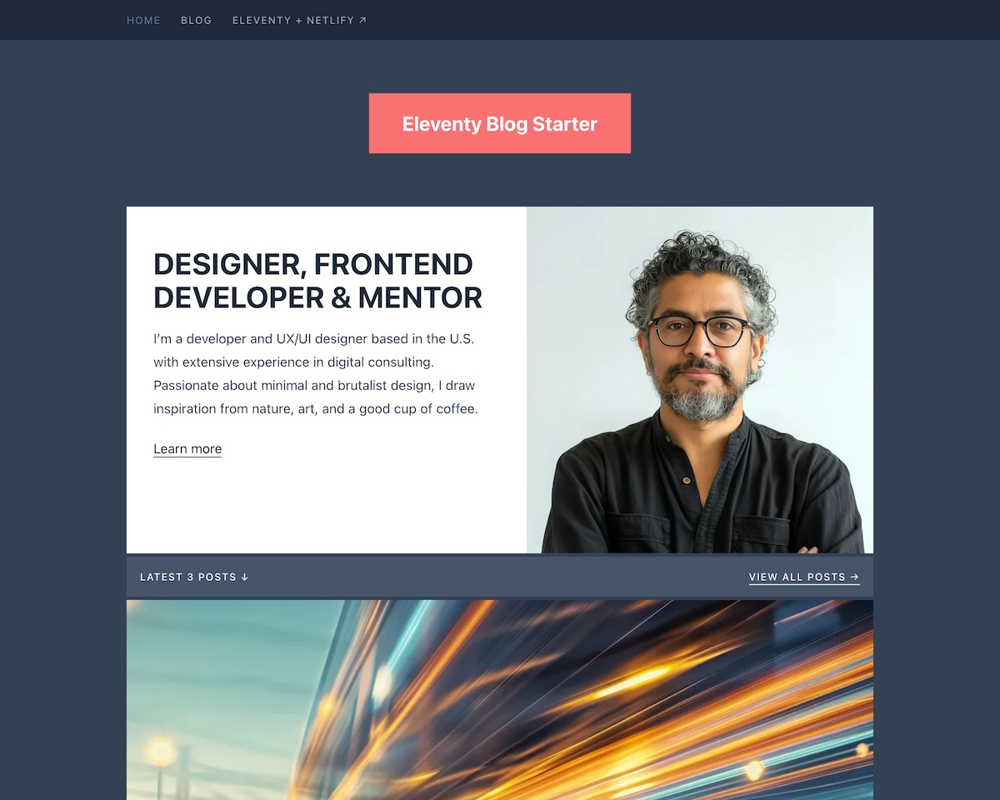

# Eleventy (11ty) Blog Starter



A starter repository showing how to build a blog with the [Eleventy](https://www.11ty.dev/) and [Tailwind CSS](https://tailwindcss.com/). 

**View demo:** [https://11ty-blog-starter-demo.netlify.app/](https://11ty-blog-starter-demo.netlify.app/)

## Deploying to Netlify

If you click "Deploy to Netlify" button, it will create a new repo for you that looks exactly like this one, and sets that repo up immediately for deployment on Netlify.

[](https://app.netlify.com/start/deploy?repository=https://github.com/netlify-templates/eleventy-blog-starter)


## Getting Started

1. Clone this Repository

```
git clone https://github.com/netlify-templates/eleventy-blog-starter.git
```

2. Install dependencies

```
npm install
```

3. Run Eleventy locally

```
npm run dev
```

4. Generate a production-ready build 

```
npm run build
```

Or you can run [debug mode](https://www.11ty.dev/docs/debugging/) to see all the internals.

## Project Structure

- `content/blog/` has the blog posts but really they can live in any directory. They need only the `posts` tag to be included in the blog posts [collection](https://www.11ty.dev/docs/collections/).
- Use the `eleventyNavigation` key (via the [Eleventy Navigation plugin](https://www.11ty.dev/docs/plugins/navigation/)) in your front matter to add a template to the top level site navigation. This is in use on `content/index.njk` and `content/about/index.md`.
- Content can be in _any template format_ (blog posts needn’t exclusively be markdown, for example). Configure your project’s supported templates in `eleventy.config.js` -> `templateFormats`.
- The `public` folder in your input directory will be copied to the output folder (via `addPassthroughCopy` in the `eleventy.config.js` file). This means `./public/*` will live at `./_site/*` after your build completes.
- This project uses three [Eleventy Layouts](https://www.11ty.dev/docs/layouts/):
  - `_includes/layouts/base.njk`: the top level HTML structure
  - `_includes/layouts/home.njk`: the home page template (wrapped into `base.njk`)
  - `_includes/layouts/post.njk`: the blog post template (wrapped into `base.njk`)
- `_includes/postslist.njk` is a Nunjucks include and is a reusable component used to display a list of all the posts. `content/index.njk` has an example of how to use it.

## Support

If you get stuck along the way, get help in our [support forums](https://answers.netlify.com/).
